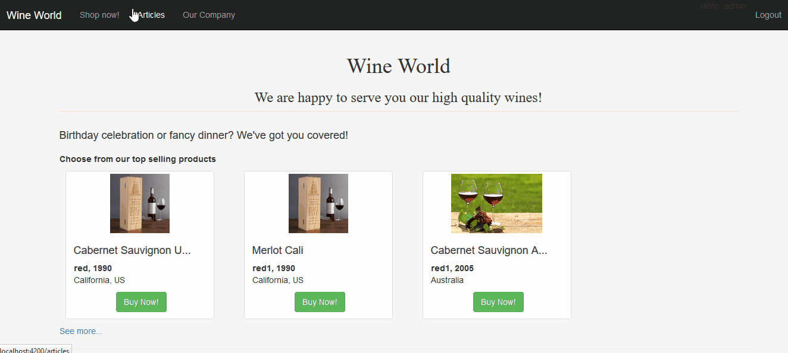

# WineWorld

WineWorld is an online wine shop which serves a wine producing and trading company.

This is a team project for the Angular 2 SPA course at Telerik Academy.

##Demo

##Functionality
You can find the project requirements [here](https://github.com/TelerikAcademy/Angular-2/tree/master/Course%20Project).

##Architecture

This project was initialized with [angular-cli](https://github.com/angular/angular-cli) version 1.0.0-beta.24.

To start the application run `npm start` and navigate to `http://localhost:4200/`.

To start the server change directory to /server `cd server` and run `node app.js`. The server will be running at `http://localhost:3000/`
